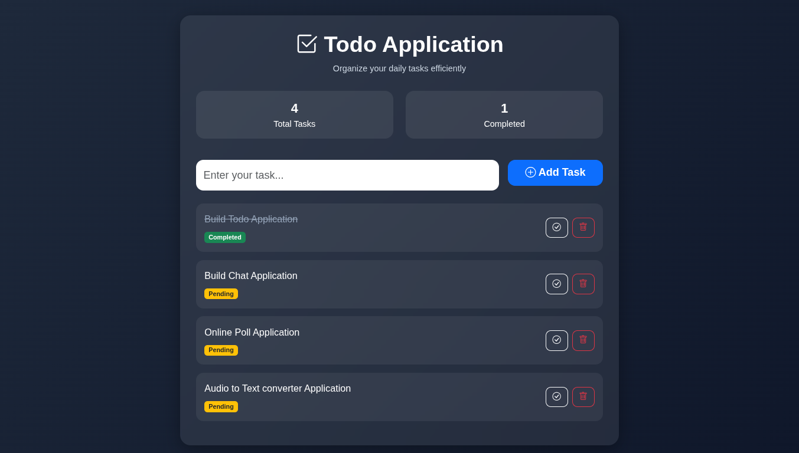

# Spring Boot Todo Application

A modern Todo Application built using **Spring Boot**, **Thymeleaf**, **Spring Data JPA**, **MySQL**, and **Bootstrap 5**.

This project demonstrates a complete CRUD-based web application using the MVC architecture.

---

# Features

* Add Tasks
* View Tasks
* Toggle Task Completion
* Delete Tasks
* Responsive Modern UI
* Bootstrap 5 Integration
* Thymeleaf Server-Side Rendering
* MySQL Database Integration
* RESTful HTTP Methods (GET, POST, PUT, DELETE)
* Layered MVC Architecture

---

# Tech Stack

| Technology      | Purpose               |
| --------------- | --------------------- |
| Java 21         | Programming Language  |
| Spring Boot     | Backend Framework     |
| Spring MVC      | Web Architecture      |
| Spring Data JPA | Database Operations   |
| Hibernate       | ORM Framework         |
| MySQL           | Database              |
| Thymeleaf       | Template Engine       |
| Bootstrap 5     | UI Styling            |
| Maven           | Dependency Management |

---

# Project Architecture

```text
Browser/UI
    ↓
Controller Layer
    ↓
Service Layer
    ↓
Repository Layer
    ↓
MySQL Database
```

---

# Project Structure

```text
src
└── main
    ├── java
    │   └── com.app.todo
    │       ├── controller
    │       │   └── TaskController.java
    │       │
    │       ├── models
    │       │   └── Task.java
    │       │
    │       ├── repository
    │       │   └── TaskRepository.java
    │       │
    │       ├── services
    │       │   └── TaskService.java
    │       │
    │       └── TodoApplication.java
    │
    └── resources
        ├── static
        │   └── css
        │       └── style.css
        │
        ├── templates
        │   └── tasks.html
        │
        ├── application.properties
        └── application-dev.properties
```

---

# Database Configuration

## Create Database

Run the following command inside MySQL:

```sql
CREATE DATABASE TodoApp;
```

---

# Application Configuration

## application.properties

```properties
spring.application.name=todo

spring.datasource.url=jdbc:mysql://localhost:3306/TodoApp

spring.jpa.hibernate.ddl-auto=update
spring.jpa.properties.hibernate.dialect=org.hibernate.dialect.MySQLDialect

spring.mvc.hiddenmethod.filter.enabled=true

spring.profiles.active=dev
```

---

## application-dev.properties

```properties
spring.datasource.username=YOUR_USERNAME
spring.datasource.password=YOUR_PASSWORD
```

This file is ignored using `.gitignore` to protect database credentials.

---

# Setup Instructions

## 1. Clone Repository

```bash
git clone https://github.com/YOUR_USERNAME/YOUR_REPOSITORY.git
```

---

## 2. Move Into Project

```bash
cd YOUR_REPOSITORY
```

---

## 3. Configure Database

Update:

```text
src/main/resources/application-dev.properties
```

with your MySQL credentials.

---

## 4. Run Application

Using Maven:

```bash
./mvnw spring-boot:run
```

OR

```bash
mvn spring-boot:run
```

---

# Open Application

```text
http://localhost:8080/tasks
```

---

# REST Endpoints

| Method | Endpoint    | Description       |
| ------ | ----------- | ----------------- |
| GET    | /tasks      | Display all tasks |
| POST   | /tasks      | Create task       |
| PUT    | /tasks/{id} | Toggle completion |
| DELETE | /tasks/{id} | Delete task       |

---

# CRUD Operations

## Create Task

Users can add new tasks using the input form.

---

## Read Tasks

All tasks are fetched from MySQL and displayed dynamically using Thymeleaf.

---

## Update Task

Task completion status can be toggled using PUT requests.

---

## Delete Task

Tasks can be removed using DELETE requests.

---

# UI Features

* Glassmorphism Design
* Responsive Layout
* Bootstrap Cards
* Dynamic Task Status
* Completed Task Styling
* Empty State Screen
* Bootstrap Icons

---

# Important Spring Boot Concepts Used

* Dependency Injection
* MVC Architecture
* Service Layer Pattern
* Repository Pattern
* ORM (Hibernate)
* Thymeleaf Template Rendering
* RESTful Routing
* Hidden HTTP Method Filter

---

# Future Improvements

* Edit Task Feature
* User Authentication
* Task Priority Levels
* Due Dates
* Search & Filter
* Pagination
* REST API Version
* Docker Deployment
* React Frontend Integration

---

# Screenshots

Home Page.

---

# Author

AMARAVADI SANJAY

---

# License

This project is for learning and educational purposes.
